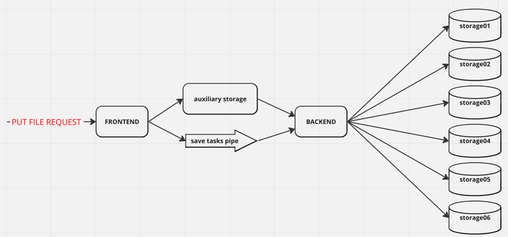
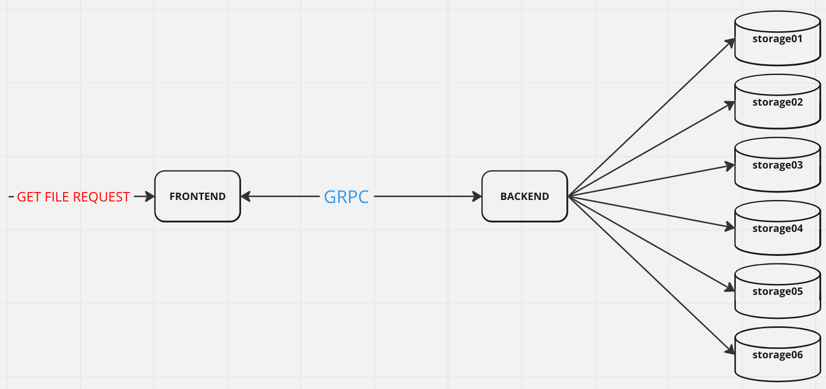

# Test storage system

## Description

### Common Architecture

* Frontend is responsible for getting users request.
* Short term storage is responsible for storing data for a short period of time.
* Tasks pipe is responsible for users task queue.
* Backend worker is responsible for processing users requests.
* Long term storage is responsible for storing data for a long period of time.

All components are independent and can be scaled separately.

### Common algorithm

#### Put file

* Frontend receives user request and save data to short term storage, save task to tasks pipe and send response to user.
* Backend worker receives task from tasks pipe.
* Backend worker divides data for chunks according to storage nodes quantity.
* Backend worker saves each chunk to separate long term storage node.



#### Get file

* Frontend receives user request.
* Frontend sends grpc request to backend.
* Backend gets user data chunks from long term storage and restore file content.
* Frontend sends response to user.



## Improvements

It's just a draft of the system. There are a lot of things to improve:

* Auth
* Various limiters
* Logging with levels
* Monitoring with metrics
* Health checks
* More unit/integration tests
* More comments
* Implement freeing space flow for short term storage
* Automate new storage nodes adding (now it's possible to add new storage nodes only manually via backend start parameters)
* Metadata for content with states, chunks...
* Metadata for storage nodes with states, size, free space... (currently we store data by round robin algorithm for all storage nodes)
* Mechanism to work with errors from short/long term storages
* File chunks redundancy
* Automatic balancing for storage nodes
* Message broker/Kafka for tasks pipe
* Choose short term storage for the project (currently it's redis)
* Choose long term storage for the project (currently it's redis)
* Backup system and strategy
* and so on...

## How to run and what do we get

```bash
docker compose build && docker compose up -d && docker ps | grep k8
```
There will be 9 containers:
* one frontend (http://127.0.0.1:58080/files)
* one backend
* one short time storage (redis, data pipe is redis list)
* six long time storages (redis)

### POST /files

```
{
  ClientID string `json:"client_id"`
  Name     string `json:"name"`
  Data     []byte `json:"data"`
}
```
* All parameters are required.
* If there is a problem with request parameters, then the endpoint returns http.StatusBadRequest.
* If there is a problem with saving data to the short time storage, then the endpoint returns http.StatusInternalServerError.
* http.StatusOK is returned if everything is ok.

### GET /files

Parameters:
```
client_id - string
name - string
```
* All parameters are required.
* If there is a problem with request parameters, then the endpoint returns http.StatusBadRequest.
* If there is a problem with getting data from the long time storage, then the endpoint returns http.StatusInternalServerError.
* http.StatusOK with the file data is returned if everything is ok.

Response parameters:
```
{
  Name string `json:"name"`
  Data []byte `json:"data,omitempty"`
}
```

## How to test

```bash
cd ./cmd/test && go run main.go
```

There will be two tests

* First test
  * read test01.json file
  * print content
  * put test01.json file data into storage
  * get test01.json file data from storage
  * print content from storage

* Second test
  * read storage.png file
  * put storage.png file data into storage
  * get storage.png data from storage
  * create new storage_from_storage.png file with received data


